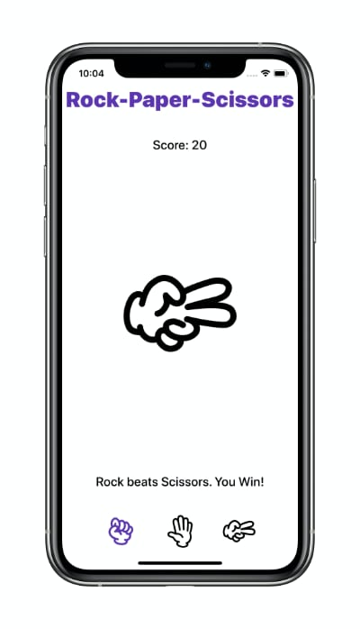

# RockPaperScissors
Rock Paper Scissors Game in SwiftUI

<p align="center">
  
</p>

## QuickStart
1. Clone this repository.
```
$ git clone https://github.com/harrisonrw/RockPaperScissors.git
```

2. Open the project in Xcode.
```
$ open RockPaperScissors.xcodeproj
```

3. Build and Run in the **iOS Simulator**.

## Requirements
- Xcode 11.4
- iOS 13.4+
- Swift 5

## Image Credits
- Fist by Cristiano Zoucas from the Noun Project
- wave by Cristiano Zoucas from the Noun Project
- Scissors by Cristiano Zoucas from the Noun Project